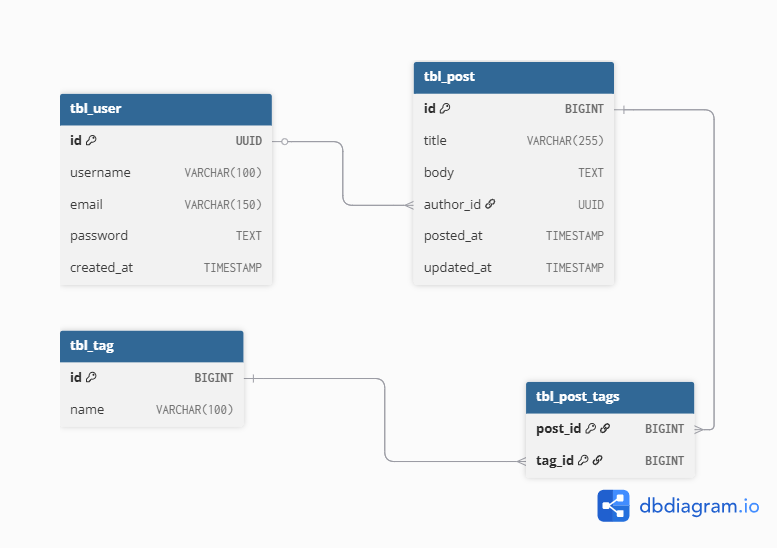

# Blogging Platform - Spring Boot

A production-ready, enterprise-grade blogging platform built with Spring Boot 3.5.9 featuring dual API support (REST +
GraphQL), comprehensive performance monitoring, intelligent caching, and advanced cross-cutting concerns through
Aspect-Oriented Programming.

## Table of Contents

- [Overview](#overview)
- [Features](#features)
- [Security Overview](#security-overview)
- [Architecture](#architecture)
- [Quick Start](#quick-start)
- [API Documentation](#api-documentation)
- [Documentation Index](#documentation-index)
- [Database Schema](#database-schema)
- [Performance & Monitoring](#performance--monitoring)
- [Technology Stack](#technology-stack)
- [Project Structure](#project-structure)
- [Testing](#testing)
- [Configuration](#configuration)
- [Contributing](#contributing)
- [License](#license)

## Overview

This blogging platform is a full-featured content management system designed with modern software engineering practices.
It demonstrates enterprise-level patterns including:

- **Dual API Architecture** - REST and GraphQL for maximum flexibility
- **Hybrid Database Strategy** - PostgreSQL for relational data, MongoDB for flexible documents
- **Production-Ready Monitoring** - Performance metrics, cache statistics, and comprehensive logging
- **Security Best Practices** - Sensitive data masking, input validation, and secure password hashing
- **High Test Coverage** - 80%+ code coverage with unit, integration, and E2E tests

## Features

### Core Functionality

- ✅ **User Management** - Registration, authentication, profile management
- ✅ **Post Operations** - Create, read, update, delete with rich text support
- ✅ **Comments System** - Threaded comments stored in MongoDB for flexibility
- ✅ **Tagging System** - Many-to-many relationships with intelligent tag management
- ✅ **Advanced Search** - Filtering, pagination, sorting by multiple criteria

### API & Integration

- 🚀 **Dual API Support** - REST (OpenAPI 3.0) + GraphQL with schema introspection
- 📚 **Interactive Documentation** - Swagger UI for REST, GraphiQL for GraphQL
- 🔄 **Real-time Schema** - GraphQL schema with type-safe queries and mutations
- 🌐 **CORS Support** - Configured for cross-origin requests

### Performance & Monitoring

- 📊 **Performance Metrics** - Method-level execution time tracking
- 💾 **Intelligent Caching** - Multi-level caching with hit/miss rate monitoring
- 📈 **Cache Analytics** - Hit rates, miss rates, eviction tracking per cache
- 📁 **Metrics Export** - Combined performance and cache metrics to file and logs
- ⚡ **Query Optimization** - Indexed database queries with lazy loading

### Cross-Cutting Concerns (AOP)

- 🔍 **Comprehensive Logging** - Request/response logging with execution tracking
- 🎭 **Sensitive Data Masking** - Automatic PII protection in logs
- 🛡️ **Exception Handling** - Centralized error handling with detailed responses
- ⏱️ **Performance Monitoring** - Real-time method execution tracking
- 🔔 **Slow Query Detection** - Automatic alerts for methods exceeding thresholds

### Data & Storage

- 🗄️ **Hybrid Database** - PostgreSQL for structured data, MongoDB for flexible documents
- 🔐 **Secure Storage** - Bcrypt password hashing
- 📦 **Data Validation** - Jakarta Bean Validation throughout
- 🔄 **Transaction Management** - ACID compliance for critical operations

### Security

- 🔑 **JWT Authentication** - Stateless, dual-token (access + refresh) architecture
- 🌐 **OAuth2 Integration** - Google social login with internal JWT bridge
- 👥 **Role-Based Access Control** - ADMIN, AUTHOR, READER roles with URL and method-level security
- 🛡️ **CORS Protection** - Configured allowed origins for API access control
- 🔒 **Secure Token Storage** - HttpOnly cookies for refresh tokens, SameSite protection
- 🚫 **Token Revocation** - Immediate invalidation with in-memory blacklist

### Quality Assurance

- ✅ **80%+ Test Coverage** - Comprehensive test suite with JaCoCo reporting
- 🧪 **Multiple Test Types** - Unit, integration, and GraphQL tests
- 🎯 **Continuous Testing** - Automated test execution with Maven
- 📊 **Coverage Reports** - Detailed HTML coverage analysis

## Security Overview

The application implements a comprehensive, stateless security model:

| Layer              | Implementation                                                          |
|--------------------|-------------------------------------------------------------------------|
| **Authentication** | JWT-based with separate access/refresh tokens                           |
| **Social Login**   | OAuth2 with Google, bridged to internal JWT issuance                    |
| **Authorization**  | Role-Based Access Control (ADMIN, AUTHOR, READER)                       |
| **API Protection** | URL-level rules in SecurityConfig + method-level @PreAuthorize          |
| **Token Storage**  | Access token in header, refresh token in HttpOnly cookie (SameSite=Lax) |
| **Session**        | Stateless (no server sessions), with token revocation support           |
| **CORS**           | Explicitly configured allowed origins with credentials support          |
| **CSRF**           | Disabled (not required for stateless JWT authentication)                |

**Detailed Documentation:**

- [Security Architecture](docs/security/security-architecture.md) - Filter chain, configuration layers
- [JWT Flow](docs/security/jwt-flow.md) - Token lifecycle, validation, refresh
- [OAuth2 Flow](docs/security/oauth2-flow.md) - Google integration and JWT bridge
- [RBAC](docs/security/rbac.md) - Roles, permissions, access matrix
- [CORS vs CSRF](docs/security/cors-vs-csrf.md) - Protection mechanisms explained

## Architecture

### High-Level Architecture

```
┌─────────────────────────────────────────────────────────────┐
│                    Client Applications                      │
│            (Web, Mobile, Third-party Services)              │
└────────────┬──────────────────────────────┬─────────────────┘
             │                              │
             ▼                              ▼
      ┌─────────────┐              ┌──────────────┐
      │   REST API  │              │  GraphQL API │
      │  (OpenAPI)  │              │  (Schema)    │
      └──────┬──────┘              └──────┬───────┘
             │                            │
             └────────────┬───────────────┘
                          ▼
              ┌───────────────────────┐
              │   Controllers Layer   │
              │  (REST & GraphQL)     │
              └───────────┬───────────┘
                          │
                          ▼
              ┌───────────────────────┐
              │    AOP Aspects        │◄──── Logging
              │  (Cross-cutting)      │◄──── Performance
              └───────────┬───────────┘◄──── Caching
                          │            ◄──── Masking
                          ▼
              ┌───────────────────────┐
              │   Services Layer      │
              │  (Business Logic)     │
              └───────────┬───────────┘
                          │
             ┌────────────┴────────────┐
             ▼                         ▼
      ┌─────────────┐          ┌─────────────┐
      │ Repository  │          │ Repository  │
      │ (JPA/SQL)   │          │ (MongoDB)   │
      └──────┬──────┘          └──────┬──────┘
             │                        │
             ▼                        ▼
      ┌─────────────┐          ┌─────────────┐
      │ PostgreSQL  │          │  MongoDB    │
      │ (Relational)│          │ (Document)  │
      └─────────────┘          └─────────────┘
```

### Design Patterns Used

- **Repository Pattern** - Data access abstraction
- **DTO Pattern** - Request/response data transfer
- **Aspect-Oriented Programming** - Cross-cutting concerns
- **Service Layer Pattern** - Business logic encapsulation
- **Builder Pattern** - Complex object construction (DTOs)
- **Factory Pattern** - GraphQL type creation
- **Singleton Pattern** - Cache statistics management

## Quick Start

### Prerequisites

- Java 21+
- Maven 3.6+
- PostgreSQL 17+
- MongoDB 4.0+

### Installation & Running

```bash
# 1. Clone the repository
git clone <repository-url>
cd BloggingPlatform-Spring

# 2. Configure databases in src/main/resources/application-dev.properties
# PostgreSQL and MongoDB connection settings

# 3. Build the project
mvn clean install

# 4. Run the application
mvn spring-boot:run
```

### Access Points

Once running, access the application at:

| Interface               | URL                                                 | Description                         |
|-------------------------|-----------------------------------------------------|-------------------------------------|
| **Swagger UI**          | http://localhost:8080/swagger-ui.html               | REST API documentation & testing    |
| **GraphiQL**            | http://localhost:8080/graphiql                      | GraphQL interactive query interface |
| **OpenAPI Spec**        | http://localhost:8080/v3/api-docs                   | OpenAPI 3.0 JSON specification      |
| **REST API**            | http://localhost:8080/api/*                         | RESTful endpoints base path         |
| **GraphQL API**         | http://localhost:8080/graphql                       | GraphQL endpoint                    |
| **Performance Metrics** | http://localhost:8080/api/metrics/performance       | Performance monitoring endpoints    |
| **Cache Metrics**       | http://localhost:8080/api/metrics/performance/cache | Cache statistics                    |

## API Documentation

### REST API Endpoints

#### Auth API (`/api/auth`)

- `POST /register` - Register a new user
- `POST /sign-in` - Authenticate user and issue tokens
- `POST /refresh-token` - Rotate/refresh access token
- `POST /sign-out` - Revoke session and clear refresh token

#### Users API (`/api/users`)

- `GET /profile` - Get authenticated user's profile

#### Posts API (`/api/posts`)

- `POST /old` (`application/json`) - Create post without image
- `POST /` (`multipart/form-data`) - Create post with optional image (`post` + optional `image`)
- `GET /` - Get all posts (paginated, filterable, sortable)
- `GET /{postId}` - Get post by ID
- `GET /popular?limit=10` - Get popular posts (index + cache optimized)
- `GET /trending?limit=10` - Get trending posts (index + cache optimized)
- `PUT /{postId}` - Update existing post
- `DELETE /{postId}` - Delete post

#### Comments API (`/api/comments`)

- `POST /` - Add comment to a post
- `GET /post/{postId}` - Get all comments for a post
- `GET /{commentId}` - Get specific comment
- `DELETE /{commentId}` - Delete comment

#### Tags API (`/api/tags`)

- `GET /popular` - Get most used tags

#### Feed API (`/api/feed`)

- `GET /` - Aggregated feed (recent/trending/popular)
- `GET /trending/live` - Live trending deltas and movement
- `POST /trending/refresh` - Force trending snapshot refresh

#### Moderation API (`/api/moderation`) *(admin)*

- `POST /bulk` - Queue bulk moderation task
- `GET /tasks/{taskId}` - Get moderation task status
- `GET /tasks` - List moderation tasks

#### Notification API (`/api/notifications`) *(admin)*

- `POST /` - Queue notification outbox event
- `GET /{notificationId}` - Get notification status
- `GET /stats` - Get outbox processing statistics

#### Reports API (`/api/reports`) *(admin)*

- `POST /export` - Start async report generation
- `GET /{reportId}` - Get report metadata/status
- `GET /download/{reportId}` - Download generated report
- `GET /` - List reports

#### Image API (`/api/images`)

- `POST /upload/{postId}` (`multipart/form-data`) - Upload image for a post
- `GET /status/{imageId}` - Get upload status
- `GET /post/{postId}` - List post images
- `GET /post/{postId}/completed` - List completed post images
- `POST /retry/{imageId}` - Retry failed image upload
- `DELETE /{imageId}` - Delete image

#### Performance Metrics API (`/api/metrics/performance`)

- `GET /` - Get all performance metrics
- `GET /summary` - Get metrics summary
- `GET /{layer}/{methodName}` - Get specific method metrics
- `DELETE /reset` - Reset all performance metrics
- `POST /export-log` - Export performance metrics to file
- `GET /cache` - Get all cache metrics
- `GET /cache/{cacheName}` - Get specific cache metrics
- `GET /cache/summary` - Get cache performance summary
- `DELETE /cache/reset` - Reset cache statistics
- `POST /cache/export-log` - Export cache metrics to file
- `POST /export-all` - Export combined metrics to file
- `GET /runtime` - Get API runtime metrics (latency, req/sec, memory)
- `POST /runtime/export` - Export runtime metrics to CSV table
- `DELETE /runtime/reset` - Reset runtime metrics counters

### GraphQL API

**Query Operations:**

```graphql
# Get all posts with pagination
getAllPosts(page: Int, size: Int, sortBy: String, sortDirection: String, author: String, tags: [String!], search: String): PostPage!

# Get post by ID with relationships
getPost(postId: Int!): Post

# Get user by ID
getUser(userId: UUID!): User

# Get comments for a post
getCommentsByPost(postId: Int!): [Comment!]!
```

**Mutation Operations:**

```graphql
# Create a new post
createPost(input: CreatePostInput!): Post!

# Update existing post
updatePost(postId: Int!, input: UpdatePostInput!): Post!

# Delete post
deletePost(postId: Int!): Boolean!

# Create comment
createComment(input: CreateCommentInput!): Comment!
```

### Access Rules (Current SecurityConfig)

- Public: `/api/auth/**`, `/oauth2/**`, `/login/oauth2/**`, `/graphql`, `/graphiql`, `/swagger-ui/**`, `/v3/api-docs/**`, `/actuator/health`
- Public GET: `/api/posts/**`, `/api/tags/**`
- Public feed: `/api/feed/**` (all methods)
- Admin-only: `/api/admin/**`, `/api/users/**`, `/api/metrics/performance/**`, `/api/security/audit/**`, `/actuator/**`

## Documentation Index

Centralized docs navigation lives in [docs/README.md](docs/README.md).

**For detailed examples:**

- **REST API**: Visit [Swagger UI](http://localhost:8080/swagger-ui.html) or see [ENDPOINTS.md](dev/ENDPOINTS.md)
- **GraphQL**: Visit [GraphiQL](http://localhost:8080/graphiql) or
  see [GraphQL Test Queries](docs/graphql/GRAPHQL_TEST_QUERIES.md)

## Database Schema

### Entity Relationship Diagram



### Relationships

| Relationship   | Type          | Description                                                     |
|----------------|---------------|-----------------------------------------------------------------|
| User → Post    | 1:N           | A user can create multiple posts                                |
| Post → Tag     | M:N           | Posts can have multiple tags; tags can belong to multiple posts |
| Post → Comment | 1:N (virtual) | Comments reference posts via post_id (stored in MongoDB)        |
| User → Comment | 1:N (virtual) | Comments reference users via author_id (stored in MongoDB)      |

### Database Indexes

**PostgreSQL:**

- Users: `idx_username`, `idx_email`, `idx_created_at`
- Posts: `idx_author_id`, `idx_posted_at`, `idx_author_posted`
- Tags: `idx_name`

**MongoDB:**

- Comments: Auto-indexed on `_id`, indexed on `post_id`, `author_id`

**For detailed database documentation:**

- [Complete Database Schema](docs/DATABASE_SCHEMA.md) - Full schema with SQL, relationships, and data flow
- [Entity Relationship Diagram](docs/ER_DIAGRAM.md) - Visual ER diagrams with detailed cardinality
- [Database Quick Reference](docs/DATABASE_QUICK_REFERENCE.md) - Quick lookup for tables and queries

## Performance & Monitoring

### Performance Metrics

The application tracks detailed performance metrics for all service-layer methods:

- **Execution Time**: Min, max, and average execution times
- **Call Statistics**: Total calls, successful calls, failed calls
- **Failure Rate**: Percentage of failed operations
- **Slow Query Detection**: Automatic logging of methods exceeding 1000ms

**Access metrics:**

```bash
# Get all performance metrics
curl http://localhost:8080/api/metrics/performance

# Get metrics summary
curl http://localhost:8080/api/metrics/performance/summary

# Export to file (creates metrics/YYYYMMDD-HHmmss-performance-summary.log)
curl -X POST http://localhost:8080/api/metrics/performance/export-log

# Get runtime API metrics (latency/throughput/memory)
curl "http://localhost:8080/api/metrics/performance/runtime?limit=10"

# Export runtime metrics CSV table (creates metrics/runtime/YYYYMMDD-HHmmss-runtime-metrics.csv)
curl -X POST "http://localhost:8080/api/metrics/performance/runtime/export?limit=20"
```

### Profiling Workflow (Baseline → Optimized)

1. Save baseline and reset metrics:

```bash
curl -X POST http://localhost:8080/api/metrics/performance/baseline
```

2. Run concurrent profile workload:

```bash
bash dev/performance-tests/run-admin-profile.sh
```

3. Save optimized snapshot and compare:

```bash
curl -X POST http://localhost:8080/api/metrics/performance/postcache
curl http://localhost:8080/api/metrics/performance/comparison/database
```

4. Export runtime + method/cache metrics tables:

```bash
curl -X POST "http://localhost:8080/api/metrics/performance/runtime/export?limit=25"
curl -X POST http://localhost:8080/api/metrics/performance/export-all
```

Related reports:

- `docs/performance/BASELINE_PERFORMANCE_SUMMARY.md`
- `docs/performance/CONCURRENT_API_CALLS_TEST_REPORT.md`
- `docs/performance/CONCURRENCY_THREAD_SAFETY_TUNING_REPORT.md`
- `docs/performance/RETRIEVAL_OPTIMIZATION_REPORT.md`
- `docs/performance/FINAL_OPTIMIZATION_REPORT.md`

### Cache Monitoring

Intelligent caching with comprehensive statistics tracking:

**Caches:**

- `users` - User profile caching
- `posts` - Individual post caching
- `postsList` - Post list caching
- `comments` - Comment caching
- `tags` - Popular tags caching
- `popularPosts` - Popular post ranking caching
- `trendingPosts` - Trending post ranking caching

### Retrieval Optimization Notes

- Popular/trending retrieval now uses in-memory ranking indexes plus cache-backed top-K reads.
- Post list mapping avoids N+1 comment-count queries via bulk aggregation.
- Method comparison lookups now use indexed matching instead of linear scans.

Detailed benchmark report:

- [Data & Algorithmic Optimization Report](docs/performance/RETRIEVAL_OPTIMIZATION_REPORT.md)

**Metrics tracked per cache:**

- Hit/Miss counts and rates
- Total requests
- Cache puts (additions)
- Evictions (removals)
- Cache clears

**Access cache metrics:**

```bash
# Get all cache metrics
curl http://localhost:8080/api/metrics/performance/cache

# Get cache summary with hit rates
curl http://localhost:8080/api/metrics/performance/cache/summary

# Get specific cache metrics
curl http://localhost:8080/api/metrics/performance/cache/users

# Export cache metrics to file
curl -X POST http://localhost:8080/api/metrics/performance/cache/export-log

# Export combined performance + cache metrics
curl -X POST http://localhost:8080/api/metrics/performance/export-all
```

**Example cache summary response:**

```json
{
  "totalCaches": 5,
  "totalHits": 1523,
  "totalMisses": 287,
  "totalRequests": 1810,
  "overallHitRate": "84.14%",
  "totalPuts": 342,
  "totalEvictions": 12,
  "bestPerformingCache": {
    "name": "users",
    "hitRate": "92.31%"
  },
  "worstPerformingCache": {
    "name": "allPosts",
    "hitRate": "67.45%"
  }
}
```

### Logging & Data Masking

All requests and responses are logged with automatic sensitive data masking:

- **Masked Fields**: Passwords, email addresses (partially), authentication tokens
- **Request/Response Logging**: Method name, execution time, parameters (masked)
- **Exception Tracking**: Detailed error logging with stack traces
- **Performance Alerts**: Automatic warnings for slow operations

## Documentation

Comprehensive documentation is available in the `docs/` directory:

### API Documentation

- **[OpenAPI Documentation Guide](docs/api/OPENAPI_DOCUMENTATION_GUIDE.md)** - Complete guide to REST API with Swagger
  UI, including all endpoints, request/response examples, and integration instructions

### GraphQL Documentation

- **[GraphQL Guide](docs/graphql/GRAPHQL_GUIDE.md)** - Implementation details and integration guide
- **[GraphQL Test Queries](docs/graphql/GRAPHQL_TEST_QUERIES.md)** - Example queries and mutations for all operations
- **[GraphQL Implementation Summary](docs/graphql/GRAPHQL_IMPLEMENTATION_SUMMARY.md)** - Technical architecture and
  resolver details
- **[GraphQL README](docs/graphql/README_GRAPHQL.md)** - Quick start guide

### AOP (Aspect-Oriented Programming) Documentation

- **[AOP Implementation Guide](docs/aop/AOP_IMPLEMENTATION_GUIDE.md)** - Complete guide to logging, performance
  monitoring, and exception tracking
- **[AOP Quick Reference](docs/aop/AOP_QUICK_REFERENCE.md)** - Quick reference for aspect usage
- **[Performance Metrics Guide](docs/aop/PERFORMANCE_METRICS_GUIDE.md)** - Performance monitoring setup and usage
- **[Performance Metrics Quick Reference](docs/aop/PERFORMANCE_METRICS_QUICK_REFERENCE.md)** - Quick reference for
  metrics endpoints
- **[Cache Monitoring Guide](docs/aop/CACHE_MONITORING_GUIDE.md)** - Cache statistics and monitoring
- **[Sensitive Data Masking](docs/aop/SENSITIVE_DATA_MASKING.md)** - Security and privacy features
- **[Request Masking Examples](docs/aop/REQUEST_MASKING_EXAMPLES.md)** - Examples of data masking in action

### Security Documentation

- **[Security Architecture](docs/security/security-architecture.md)** - High-level security design, filter chain flow,
  and configuration layers
- **[JWT Authentication Flow](docs/security/jwt-flow.md)** - Token generation, validation, refresh, and revocation
  mechanisms
- **[OAuth2 Integration](docs/security/oauth2-flow.md)** - Google OAuth2 authorization code flow and JWT bridge
- **[Role-Based Access Control](docs/security/rbac.md)** - Role hierarchy, permission mapping, and access matrix
- **[CORS vs CSRF](docs/security/cors-vs-csrf.md)** - Cross-origin and request forgery protection explained

### Additional Documentation

- **[API Endpoints Reference](dev/ENDPOINTS.md)** - Complete REST API endpoint reference with request/response examples

## API Access

### REST API Quick Examples

```bash
# Register a user
curl -X POST http://localhost:8080/api/auth/register \
  -H "Content-Type: application/json" \
  -d '{"username":"john_doe","email":"john@example.com","password":"SecurePass123!"}'

# Create a post (JSON endpoint)
curl -X POST http://localhost:8080/api/posts/old \
  -H "Content-Type: application/json" \
  -H "Authorization: Bearer <access_token>" \
  -d '{"title":"My First Post","body":"This is the content of my post","tags":["tech","spring"]}'

# Get all posts with pagination and sorting
curl "http://localhost:8080/api/posts?page=0&size=10&sort=lastUpdated&order=DESC"

# Add a comment
curl -X POST http://localhost:8080/api/comments \
  -H "Content-Type: application/json" \
  -H "Authorization: Bearer <access_token>" \
  -d '{"postId":1,"commentContent":"Great post!"}'

# Get performance metrics summary
curl http://localhost:8080/api/metrics/performance/summary

# Get cache statistics
curl http://localhost:8080/api/metrics/performance/cache/summary
```

**For complete endpoint documentation, visit [Swagger UI](http://localhost:8080/swagger-ui.html) or
see [API Endpoints Reference](dev/ENDPOINTS.md)**

### GraphQL Quick Example

```graphql
# Query: Get post with author and tags
query {
  getPost(postId: 1) {
        id
        title
        body
    createdAt
        author {
            id
            username
            email
        }
        tags {
            id
            name
        }
    }
}

# Mutation: Create a new post
mutation {
    createPost(input: {
        title: "My GraphQL Post"
        body: "Content created via GraphQL"
        tags: ["graphql", "api"]
    }) {
        id
        title
    createdAt
    }
}

# Query: Get paginated posts
query {
  getAllPosts(page: 0, size: 10, sortBy: "updatedAt", sortDirection: "desc") {
    content {
      id
      title
      author {
        username
      }
      tags {
        name
      }
    }
    totalElements
    totalPages
    }
}
```

**For more examples, visit [GraphiQL](http://localhost:8080/graphiql) or
see [GraphQL Test Queries](docs/graphql/GRAPHQL_TEST_QUERIES.md)**

## Technology Stack

### Core Framework

- **Spring Boot** 3.5.9 (Latest stable release)
- **Java** 21 (LTS with modern features)
- **Maven** 3.6+ (Dependency management and build)

### Databases

- **PostgreSQL** 12+ (Relational data: Users, Posts, Tags)
- **MongoDB** 4.0+ (Document storage: Comments)
- **H2** 2.2.224 (In-memory database for testing)

### APIs & Documentation

- **Spring Web** - RESTful API implementation
- **Spring GraphQL** - GraphQL API implementation
- **SpringDoc OpenAPI** 2.8.15 - OpenAPI 3.0 specification + Swagger UI
- **GraphiQL** - Interactive GraphQL interface

### Data Access

- **Spring Data JPA** - PostgreSQL repository abstraction
- **Spring Data MongoDB** - MongoDB repository abstraction
- **Hibernate** - JPA implementation with optimizations

### Cross-Cutting Concerns

- **Spring AOP** - Aspect-Oriented Programming
- **Spring Boot Actuator** - Production monitoring
- **Spring Cache** - Caching abstraction with statistics

### Security & Validation

- **Jakarta Bean Validation** - Input validation
- **BCrypt** 0.10.2 - Secure password hashing

### Testing

- **JUnit 5** - Unit testing framework
- **Mockito** - Mocking framework
- **Spring Test** - Integration testing support
- **Spring GraphQL Test** - GraphQL testing utilities
- **JaCoCo** 0.8.12 - Code coverage analysis

### Additional Libraries

- **Lombok** - Boilerplate code reduction
- **SLF4J/Logback** - Logging framework

## Project Structure

```
BloggingPlatform-Spring/
├── src/
│   ├── main/
│   │   ├── java/org/amalitech/bloggingplatformspring/
│   │   │   ├── aop/                         # Aspect-Oriented Programming
│   │   │   │   ├── LoggingAspect.java       # Request/response logging
│   │   │   │   ├── PerformanceMonitoringAspect.java  # Performance tracking
│   │   │   │   └── config/                  # AOP configuration
│   │   │   ├── config/                      # Application configuration
│   │   │   │   ├── CacheConfig.java         # Cache setup with monitoring
│   │   │   │   ├── OpenApiConfig.java       # Swagger/OpenAPI config
│   │   │   │   └── CorsConfig.java          # CORS configuration
│   │   │   ├── controllers/                 # REST controllers
│   │   │   │   ├── UserController.java
│   │   │   │   ├── PostController.java
│   │   │   │   ├── CommentController.java
│   │   │   │   ├── TagController.java
│   │   │   │   └── PerformanceMetricsController.java
│   │   │   ├── graphql/                     # GraphQL implementation
│   │   │   │   ├── resolvers/               # Query & Mutation resolvers
│   │   │   │   ├── types/                   # GraphQL types
│   │   │   │   ├── utils/                   # GraphQL utilities
│   │   │   │   └── config/                  # GraphQL configuration
│   │   │   ├── services/                    # Business logic layer
│   │   │   │   ├── UserService.java
│   │   │   │   ├── PostService.java
│   │   │   │   ├── CommentService.java
│   │   │   │   ├── TagService.java
│   │   │   │   └── PerformanceMetricsService.java
│   │   │   ├── repository/                  # Data access layer
│   │   │   │   ├── UserRepository.java      # JPA repository
│   │   │   │   ├── PostRepository.java      # JPA repository
│   │   │   │   ├── TagRepository.java       # JPA repository
│   │   │   │   └── CommentRepository.java   # MongoDB repository
│   │   │   ├── entity/                      # Domain entities
│   │   │   │   ├── User.java                # PostgreSQL entity
│   │   │   │   ├── Post.java                # PostgreSQL entity
│   │   │   │   ├── Tag.java                 # PostgreSQL entity
│   │   │   │   └── Comment.java             # MongoDB document
│   │   │   ├── dtos/                        # Data Transfer Objects
│   │   │   │   ├── requests/                # API request DTOs
│   │   │   │   └── responses/               # API response DTOs
│   │   │   ├── exceptions/                  # Exception handling
│   │   │   │   ├── GlobalExceptionHandler.java
│   │   │   │   └── Custom exceptions
│   │   │   ├── enums/                       # Enumerations
│   │   │   └── utils/                       # Utility classes
│   │   └── resources/
│   │       ├── application.properties       # Main configuration
│   │       ├── application-dev.properties   # Development config
│   │       ├── graphql/
│   │       │   └── schema.graphqls          # GraphQL schema
│   │       ├── static/                      # Static resources
│   │       └── templates/                   # Template files
│   └── test/
│       ├── java/org/amalitech/bloggingplatformspring/
│       │   ├── aop/                         # AOP tests
│       │   ├── config/                      # Configuration tests
│       │   ├── controllers/                 # Controller tests
│       │   ├── services/                    # Service tests
│       │   ├── entity/                      # Entity tests
│       │   └── graphql/                     # GraphQL tests
│       └── resources/
│           └── application-test.properties  # Test configuration
├── docs/                                    # Documentation
│   ├── api/                                 # REST API documentation
│   ├── graphql/                             # GraphQL documentation
│   └── aop/                                 # AOP documentation
├── dev/                                     # Development resources
│   └── ENDPOINTS.md                         # API endpoint reference
├── metrics/                                 # Exported metrics (generated)
├── logs/                                    # Application logs (generated)
├── target/                                  # Build output
│   └── site/jacoco/                         # Coverage reports
├── pom.xml                                  # Maven configuration
└── README.md                                # This file
```

## Testing

### Running Tests

```bash
# Run all tests
mvn test

# Run tests with coverage report
mvn clean test

# Run specific test class
mvn test -Dtest=UserServiceTest

# Run tests and skip compilation
mvn surefire:test

# Generate coverage report
mvn jacoco:report
```

### Viewing Coverage Reports

```bash
# After running tests, open the coverage report
open target/site/jacoco/index.html

# Or navigate to:
# target/site/jacoco/index.html
```

### Test Structure

- **Unit Tests**: Service layer business logic, entity validation
- **Integration Tests**: Controller endpoints, database operations
- **GraphQL Tests**: Query and mutation resolvers
- **AOP Tests**: Logging aspects, performance monitoring
- **Coverage Target**: 80%+ line coverage (currently achieved)

### Test Configuration

Tests use:

- **H2 in-memory database** for PostgreSQL tests
- **Embedded MongoDB** for MongoDB tests
- **MockMvc** for controller testing
- **Mockito** for mocking dependencies

## Configuration

### Database Configuration

**PostgreSQL** (`application-dev.properties`):

```properties
spring.datasource.url=jdbc:postgresql://localhost:5432/blogging_db
spring.datasource.username=your_username
spring.datasource.password=your_password
spring.jpa.hibernate.ddl-auto=update
```

**MongoDB** (`application-dev.properties`):

```properties
spring.data.mongodb.uri=mongodb://localhost:27017/blogging_platform
spring.data.mongodb.database=blogging_platform
```

### Cache Configuration

Caches are pre-configured in `CacheConfig.java`:

- `users` - User profile cache
- `posts` - Individual posts
- `allPosts` - Post listings
- `comments` - Comment data
- `tags` - Popular tags

### Performance Monitoring

Performance thresholds and settings in `PerformanceMonitoringAspect.java`:

```java
private static final long SLOW_THRESHOLD_MS = 1000; // Log slow queries
```

### CORS Configuration

CORS is configured in `CorsConfig.java` for cross-origin requests:

- Allowed origins: Configurable
- Allowed methods: GET, POST, PUT, DELETE, OPTIONS
- Allowed headers: All
- Credentials: Supported

## Contributing

Contributions are welcome! Please follow these steps:

1. Fork the repository
2. Create a feature branch (`git checkout -b feature/AmazingFeature`)
3. Commit your changes (`git commit -m 'Add AmazingFeature'`)
4. Push to the branch (`git push origin feature/AmazingFeature`)
5. Open a Pull Request

Please ensure:

- Tests pass (`mvn test`)
- Code coverage remains above 80%
- Documentation is updated for new features

## License

This project is licensed under the MIT License.

## Learning Resources

- [Spring Boot Documentation](https://docs.spring.io/spring-boot/docs/current/reference/html/)
- [Spring AOP Documentation](https://docs.spring.io/spring-framework/reference/core/aop.html)
- [Spring GraphQL Documentation](https://docs.spring.io/spring-graphql/reference/)
- [SpringDoc OpenAPI Documentation](https://springdoc.org/)

---