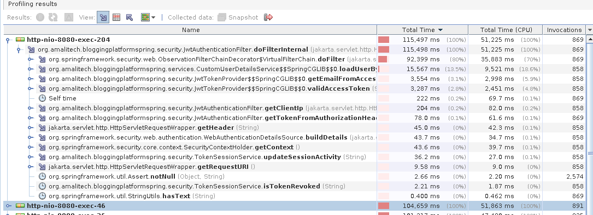
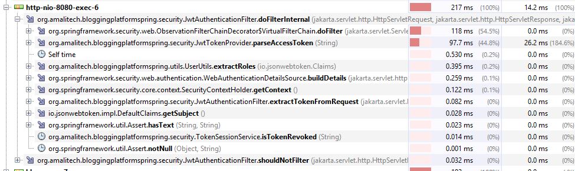
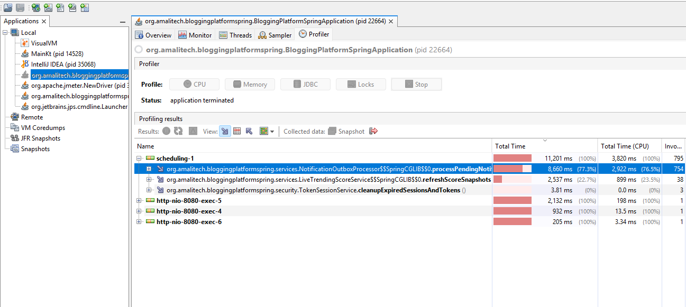
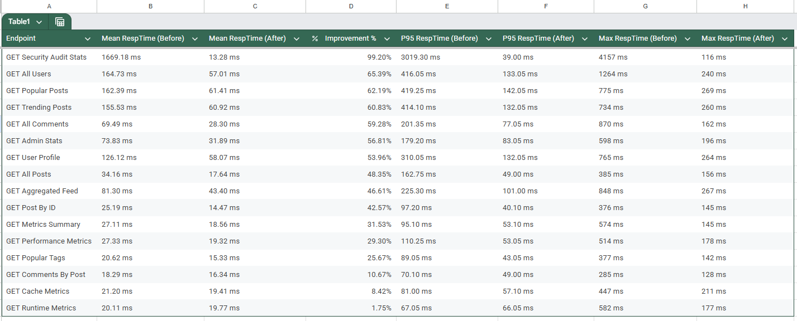
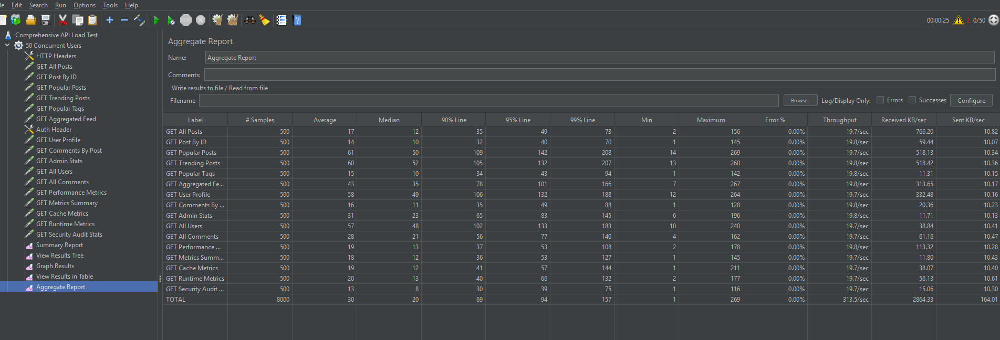

# Optimization Implementation Documentation

This document describes the actual optimization implementation in this secured backend, including asynchronous workflows, concurrency/thread-safety mechanisms, data-retrieval improvements, and metrics/reporting evidence.

## 1) Optimization Scope Implemented

Primary implementation areas:
- Image upload and processing pipeline
- Notification outbox and background delivery
- Feed aggregation and trending/popular ranking retrieval
- Security audit analytics and brute-force detection
- Runtime/performance/cache metrics capture and export
- Parallel report generation

## 2) Async and Concurrency Foundation

### Thread Pool Configuration

Asynchronous work uses `applicationTaskExecutor`:
- `corePoolSize`: default 8
- `maxPoolSize`: default 32
- `queueCapacity`: default 500
- `RejectedExecutionHandler`: `CallerRunsPolicy`
- `allowCoreThreadTimeOut`: enabled

Configured in:
- `src/main/java/org/amalitech/bloggingplatformspring/config/AsyncConfig.java`

### Why this matters

- Prevents unbounded thread creation.
- Allows controlled backpressure under load.
- Keeps API responsiveness stable when background jobs spike.

---

## 3) Feature-Level Optimization Implementation

### 3.1 Image Upload Optimization (Async + Post-Commit Execution)

Implemented components:
- `AsyncImageUploadService`
- `ImageUploadProcessor`
- `ImageUploadController`

Implementation behavior:
- Upload request persists a `PostImage` record first with status lifecycle (`PENDING -> UPLOADING -> COMPLETED` / `FAILED`).
- Binary upload processing is triggered after transaction commit to avoid async work reading uncommitted/rolled-back state.
- Cloudflare R2 storage upload executes asynchronously on `applicationTaskExecutor`.
- Retry endpoint exists for failed uploads.
- Delete flow removes both DB metadata and remote object.

Optimization value:
- Fast API acknowledgment (`202 Accepted`) while heavy upload work runs off-thread.
- Reduced request blocking for post creation/update workflows.
- Better failure isolation and recoverability with explicit status transitions.

Related endpoints:
- `POST /api/images/upload/{postId}`
- `GET /api/images/status/{imageId}`
- `POST /api/images/retry/{imageId}`
- `DELETE /api/images/{imageId}`

---

### 3.2 Notification Optimization (Outbox + Scheduled Async Processing)

Implemented components:
- `NotificationQueueService`
- `NotificationOutboxProcessor`
- `NotificationService`
- `NotificationController`

Implementation behavior:
- Notifications are queued in `notification_outbox` with status transitions (`PENDING`, `PROCESSING`, `RETRY`, `SENT`, `FAILED`).
- Background scheduler polls pending/retry items every 15 seconds.
- Individual delivery executes asynchronously (`@Async`) with retry/backoff support.
- Weekly digest generation is scheduled (Friday cron), with batched user processing.
- Cleanup job removes old processed records.

Optimization value:
- Email delivery does not block request-response paths.
- Retry mechanism improves resilience under transient failures.
- Batched and scheduled processing protects foreground API latency.

Related endpoints:
- `POST /api/notifications`
- `GET /api/notifications/{notificationId}`
- `GET /api/notifications/stats`

---

### 3.3 Feed + Ranking Optimization (In-Memory Indexing + Cache)

Implemented components:
- `PostRankingIndexService`
- `FeedAggregationService`
- `LiveTrendingScoreService`
- `FeedController`

Implementation behavior:
- Popular/trending retrieval uses in-memory ranking indexes (`ConcurrentSkipListSet`) built from snapshots.
- Snapshot store uses thread-safe `ConcurrentHashMap`.
- Index freshness is TTL-driven (60 seconds) and rebuilt safely with lock-guarded refresh.
- Cache-backed retrieval (`@Cacheable`) is applied for popular/trending queries.
- Comment counts are fetched in grouped/bulk form to reduce repeated query overhead.

Optimization value:
- Moves high-frequency ranking reads away from repeated full query/sort operations.
- Reduces DB pressure for hot endpoints.
- Improves p95/max latency stability under concurrent reads.

Related endpoints:
- `GET /api/posts/popular`
- `GET /api/posts/trending`
- `GET /api/feed`
- `GET /api/feed/trending/live`
- `POST /api/feed/trending/refresh`

---

### 3.4 Analytics and Metrics Optimization (Method/Cache/Runtime)

Implemented components:
- `PerformanceMonitoringAspect`
- `PerformanceMetricsService`
- `PerformanceMetricsController`
- `RuntimeMetricsFilter`
- `RuntimeMetricsService`

Implementation behavior:
- Method-level execution metrics are collected and summarized.
- Cache hit/miss/put/eviction statistics are aggregated and exportable.
- Runtime API metrics are collected per request in a servlet filter (`latency`, `status`, `endpoint`), including throughput and JVM memory trends.
- Async export operations avoid blocking client requests.
- Baseline (`PRE_CACHE`) vs post-optimization comparison support is implemented.

Optimization value:
- Enables evidence-driven tuning instead of guesswork.
- Provides endpoint-level and method-level visibility during stress tests.
- Supports repeatable comparison workflows from baseline to optimized state.

Related endpoints:
- `GET /api/metrics/performance`
- `GET /api/metrics/performance/summary`
- `GET /api/metrics/performance/runtime`
- `POST /api/metrics/performance/runtime/export`
- `POST /api/metrics/performance/export-all`
- `POST /api/metrics/performance/baseline`
- `GET /api/metrics/performance/comparison`

---

### 3.5 Security Analytics Optimization (Concurrent Tracking + Cached Stats)

Implemented components:
- `SecurityAuditService`
- `SecurityAuditController`

Implementation behavior:
- Security events are logged asynchronously to avoid request-path blocking.
- Brute-force detection tracks failed attempts by IP/email with thread-safe maps (`ConcurrentHashMap` + `AtomicInteger`).
- Rapid-attempt detection, DB cross-checking, scheduled cleanup, and map capacity enforcement are included.
- Security stats endpoint uses caching for summary reads.

Optimization value:
- Reduces lock contention while handling concurrent sign-in failures.
- Maintains lightweight, scalable in-memory tracking for attack patterns.
- Improves observability of security-related load and anomaly spikes.

Related endpoints:
- `GET /api/security/audit/stats`
- `GET /api/security/audit/events`
- `GET /api/security/audit/events/{eventType}`
- `GET /api/security/audit/blocked/{ipAddress}`

---

### 3.6 Parallel Report Generation

Implemented component:
- `ParallelReportExportService`

Implementation behavior:
- Report exports are queued and processed asynchronously.
- Internal content generation for some report types uses parallel `CompletableFuture` data collection.
- Progress/status lifecycle is tracked in `ReportExport`.
- Scheduled cleanup removes expired reports.

Optimization value:
- Keeps report generation workload out of synchronous request flows.
- Allows scalable processing of expensive export operations.

Related endpoints:
- `POST /api/reports/export`
- `GET /api/reports/{reportId}`
- `GET /api/reports/download/{reportId}`

---

## 4) Concurrency and Thread-Safety Structures in Use

Key structures already used in implementation:
- `ConcurrentHashMap` (security tracking, ranking snapshots, runtime endpoint metrics)
- `ConcurrentSkipListSet` (ranked popular/trending indexes)
- `ConcurrentLinkedQueue` (throughput window tracking)
- `AtomicInteger`, `AtomicLong`, `LongAdder` (high-contention counters)

Existing concurrent tests include:
- `src/test/java/org/amalitech/bloggingplatformspring/services/SecurityAuditServiceConcurrencyTest.java`
- `src/test/java/org/amalitech/bloggingplatformspring/security/TokenSessionServiceConcurrencyTest.java`

## 5) Current Performance Evidence Snapshot

From the latest before/after benchmark table:

| Endpoint | Mean Before | Mean After | Improvement |
|---|---:|---:|---:|
| GET Security Audit Stats | 1669.18 ms | 13.28 ms | 99.20% |
| GET All Users | 164.73 ms | 57.01 ms | 65.39% |
| GET Popular Posts | 162.39 ms | 61.41 ms | 62.19% |
| GET Trending Posts | 155.53 ms | 60.92 ms | 60.83% |
| GET All Comments | 69.49 ms | 28.30 ms | 59.28% |
| GET Aggregated Feed | 81.30 ms | 43.40 ms | 46.61% |
| GET Post By ID | 25.19 ms | 14.47 ms | 42.57% |

High-level observation:
- Largest gains are concentrated in security analytics and high-traffic retrieval endpoints, consistent with caching/indexing + async + concurrency improvements.

## 6) Visual Evidence (Screenshots)

### 6.1 Pre-Optimization Profiling (JWT Filter Hot Path)

This snapshot captures baseline overhead concentrated around JWT authentication filtering before optimization.

### 6.2 Post-Optimization Profiling (JWT Filter)

This snapshot shows reduced hotspot impact after optimization changes in the secured request path.

### 6.3 Pre-Optimization Scheduling/Background Profiling

This view captures baseline scheduler/background workload characteristics used for comparison.

### 6.4 Before vs After Metrics Comparison

Comparison chart/table used to validate endpoint-level latency improvements.

### 6.5 Concurrent Load Test Evidence (JMeter)

Load-test execution screenshot used to validate responsiveness and stability under concurrent traffic.

## 7) Reproducible Profiling and Benchmark Workflow

1. Save baseline metrics:
	- `POST /api/metrics/performance/baseline`
2. Run concurrent profile workload:
	- `bash dev/performance-tests/run-admin-profile.sh`
3. Save optimized snapshot:
	- `POST /api/metrics/performance/postcache`
4. Compare and export:
	- `GET /api/metrics/performance/comparison`
	- `POST /api/metrics/performance/export-all`
	- `POST /api/metrics/performance/runtime/export?limit=25`
5. Archive evidence under:
	- `docs/performance/`
	- `docs/optimization/`
	- `metrics/profiling/`
	- `metrics/runtime/`

## 8) Evidence Checklist for Final Review

For each optimization cycle, capture:
- Baseline and post-optimization metric snapshots
- p50/p95/max latency comparison tables
- Throughput and error-rate under concurrent load
- CPU + memory utilization observations during test runs
- Relevant profiler screenshots (CPU hotspots, threads, heap)
- Linked screenshots in this document (`docs/optimization/*.png`)
- Final summary and root-cause notes in `docs/performance/`

