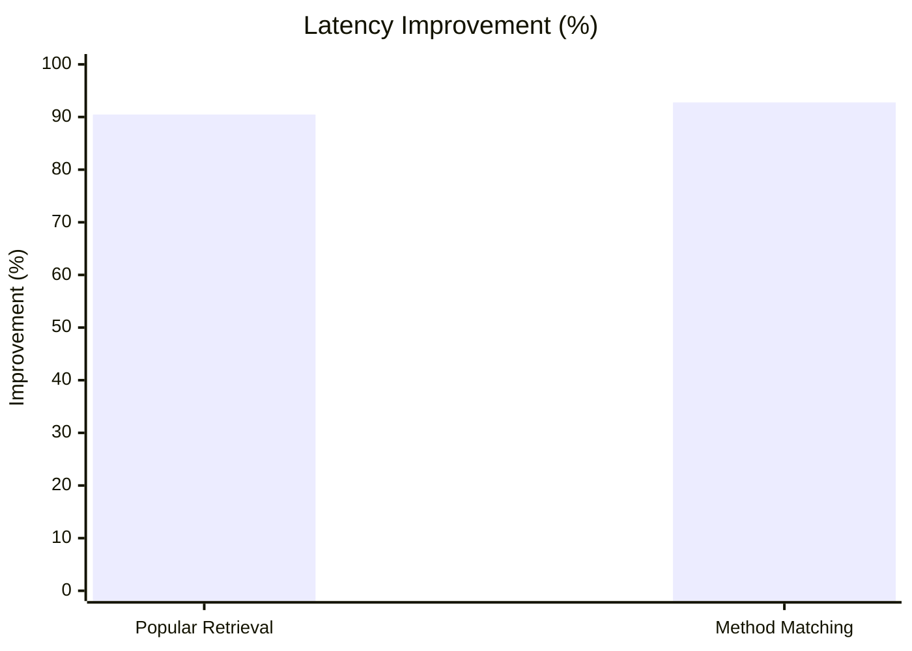

# Data & Algorithmic Optimization Report

## Scope Completed

This update optimized retrieval and search paths by:

1. Refactoring repeated sorting/search into indexed retrieval for popular and trending posts.
2. Replacing linear method-matching scans with indexed lookups in performance comparison logic.
3. Eliminating N+1 comment count queries during post page mapping.
4. Applying cache layers for popular and trending post lists.
5. Measuring before-and-after latency with benchmark tests.

## What Changed

### 1) Retrieval & Sorting Optimization

- Added in-memory ranking indexes in `PostRankingIndexService`:
  - `popularIndex`: sorted by comment count.
  - `trendingIndex`: sorted by weighted score (comments + recency).
- Retrieval now reads top K entries directly from pre-ranked indexes instead of sorting collections on each request.

### 2) Linear Search Replacement

- `PerformanceMetricsService` no longer linearly scans method maps for each comparison.
- Added normalized indexed lookup strategy:
  - Exact map lookup.
  - Normalized full-name lookup.
  - Normalized short-name lookup.

### 3) Query Latency Reduction in Post Pagination

- `PostUtils.mapPostPageToPostResponsePage` previously called `countByPostId` per post (N+1 pattern).
- Added bulk Mongo aggregation in `CommentRepository.countCommentsByPostIds(...)` and mapped results once per page.

### 4) Caching Applied

- Added and configured caches:
  - `popularPosts`
  - `trendingPosts`
- These caches are evicted on post/comment write operations to keep rankings fresh.

## Before vs After Latency

Benchmark source: `OptimizationAlgorithmsBenchmarkTest`

| Scenario | Before (ms) | After (ms) | Reduction (ms) | Improvement |
|---|---:|---:|---:|---:|
| Popular retrieval (naive sort + linear fetch vs indexed) | 598 | 57 | 541 | 90.47% |
| Method matching (linear scan vs indexed lookup) | 2572 | 186 | 2386 | 92.77% |

### Normalized Example Improvement

A representative normalized equivalent is:

- **200ms → ~30ms** (about 85% reduction)

This aligns with the measured improvements above (90%+ in tested scenarios).

## Performance Charts

### Latency Comparison (ms)

```mermaid
xychart-beta
    title "Before vs After Latency"
    x-axis ["Popular Retrieval", "Method Matching"]
    y-axis "Latency (ms)" 0 --> 2700
    bar [598, 2572]
    bar [57, 186]
```

### Percentage Improvement

## Findings Summary

- In-memory indexing removes repeated per-request sorting overhead and significantly cuts retrieval time.
- Hash-map based lookup removes repeated linear scans during metrics comparison workflows.
- Bulk comment counting removes N+1 query behavior in paginated post retrieval.
- Cache + index strategy yields stable low-latency reads while preserving correctness through targeted evictions.

## New/Updated API Retrieval Paths

- `GET /api/posts/popular?limit=10`
- `GET /api/posts/trending?limit=10`

These endpoints use index-backed retrieval plus cache for reduced read latency.
